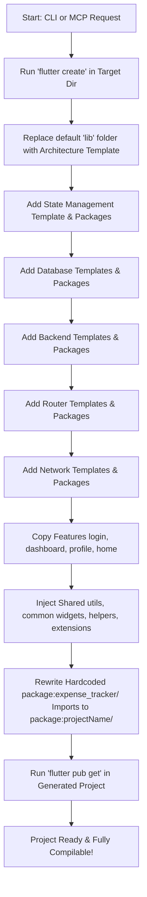

# Flutter Architect MCP

`flutter_architect_mcp` is a Model Context Protocol (MCP) server and command-line utility designed to automate the process of bootstrapping new Flutter applications. It sets up architectural structures, injects required package dependencies, sets up routing, databases, networks, and backend configurations, and copies a comprehensive collection of shared utilities, widgets, and extensions into the generated codebase.

---

## What is Provided

The project contains a complete template library and a generator pipeline organized as follows:

```
├── bin/
│   ├── server.dart                 # MCP Server entry point (communicates via stdio)
│   └── flutter_architect_mcp.dart  # Direct dart run test script
├── config/
│   ├── packages.yaml               # Map of package versions for different setup choices
│   └── architecture.yaml           # Supported architectures configuration
├── lib/
│   ├── generators/
│   │   ├── project_generator.dart      # Master orchestrator
│   │   ├── architecture_generator.dart # Clean, MVC, and MVVM template setup
│   │   ├── state_generator.dart        # Bloc, GetX, Provider, Riverpod, RxDart
│   │   ├── package_generator.dart      # Database, Router, Network, Backend setup
│   │   └── feature_generator.dart      # Generates features (login, dashboard, profile, home)
│   ├── models/
│   │   └── project_config.dart         # Encapsulates configuration parameters
│   ├── services/
│   │   ├── copy_service.dart           # Directory cloner with smart import rewriting
│   │   ├── flutter_service.dart        # Runs `flutter create` and `flutter pub get`
│   │   ├── yaml_service.dart           # YAML parser helper
│   │   └── pubspec_service.dart        # Dynamic dependency injector into pubspec.yaml
│   └── tools/
│       └── create_project.dart         # CLI runner script
└── templates/                      # Core template assets
    ├── architecture/               # Codebases for clean, mvc, and mvvm
    ├── state/                      # State configurations
    ├── network/                    # dio, retrofit templates
    ├── database/                   # hive, isar, drift templates
    ├── backend/                    # firebase, supabase templates
    ├── router/                     # go_router, auto_route, own_extensions templates
    ├── feature/                    # login, dashboard, profile, home templates
    └── shared/                     # Common widgets, extensions, and helpers
```

### Shared Assets Included:
All assets copied from `templates/shared` are automatically adjusted to compile in the new project:
* **Common Widget Components**: Dialogs, custom animated dropdowns, toast messages (flushbars), loaders, WebView wrappers, custom buttons, text fields, and list view loaders.
* **Extensions**: Padding, Alignment, Color parsing, String manipulation, DateTime formatting, Double formatting, Shimmer overlays, Svg integration, and TextStyle/BuildContext extensions.
* **Helpers**: Shared Preferences wrapper, Validation helpers, Device Connectivity checker, Deep Link helper, Notification helper, Image & Document pickers, Haptics helper, and Force Update checker.

---

## Execution Flow

When a project is generated, the tool executes the following steps:



---

## How to Use & Access

You can execute the generator in three ways:

### 1. As an MCP Tool (Recommended for AI Assistants)
Configure `flutter_architect_mcp` in your LLM desktop client (e.g., Claude Desktop, Cursor, or VS Code MCP plugin).

#### Claude Desktop Configuration:
Add this to your `claude_desktop_config.json` (usually at `~/Library/Application Support/Claude/claude_desktop_config.json` on macOS):

```json
{
  "mcpServers": {
    "flutter-architect": {
      "command": "dart",
      "args": [
        "run",
        "/Users/indianic/Desktop/Indianic_project/my_mcp/flutter_architect_mcp/bin/server.dart"
      ]
    }
  }
}
```

#### Provided Tool Schema:
* **Tool Name**: `create_project`
* **Arguments**:
  * `projectName` (String, required): Lowercase, snake_case name of the project.
  * `architecture` (String, required): `clean`, `mvc`, or `mvvm`.
  * `stateManagement` (String, optional): `bloc`, `getx`, `provider`, `riverpod`, or `rxdart`.
  * `database` (String, optional): `hive`, `isar`, or `drift`.
  * `backend` (String, optional): `firebase` or `supabase`.
  * `network` (String, optional): `dio` or `retrofit`.
  * `router` (String, optional): `go_router`, `auto_route`, or `own_extensions`.
  * `targetDirectory` (String, optional): Absolute path to output directory (defaults to current directory).

---

### 2. Via the Command Line Interface (CLI)
You can invoke the standalone CLI tool directly using the standard arguments:

```bash
dart run lib/tools/create_project.dart \
  --name my_awesome_app \
  --arch clean \
  --state bloc \
  --db hive \
  --backend firebase \
  --network dio \
  --router go_router \
  --target /path/to/output/folder
```

#### CLI Flags:
* `--name`: Name of the project (required)
* `--arch`: Architecture style: `clean`, `mvc`, `mvvm` (required)
* `--state`: State management: `bloc`, `getx`, `provider`, `riverpod`, `rxdart`
* `--db`: Local database: `hive`, `isar`, `drift`
* `--backend`: Backend service: `firebase`, `supabase`
* `--network`: Network client: `dio`, `retrofit`
* `--router`: Routing solution: `go_router`, `auto_route`, `own_extensions`
* `--target`: Absolute path of parent folder (defaults to current path)

---

### 3. Direct Programmatic Script
Run the pre-configured `flutter_architect_mcp.dart` script to quickly test or launch a default workspace setup:

```bash
dart run bin/flutter_architect_mcp.dart
```

This script generates a pre-configured project named `expense_tracker_with_mcp` with `clean` architecture, `bloc`, `hive`, `firebase`, `dio`, and `go_router` in the local directory.

---

### Example CLI Command (Custom Configuration)

To create a custom project named `mcp_first` (using MVVM, custom extensions for routing, RxDart for state management, and Dio for networking):

```bash
dart run lib/tools/create_project.dart \
  --name mcp_first \
  --arch mvvm \
  --state rxdart \
  --network dio \
  --router own_extensions
```

