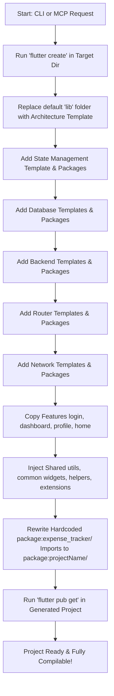

# Flutter Architect MCP

`flutter_architect_mcp` is a Model Context Protocol (MCP) server and command-line utility designed to automate the process of bootstrapping new Flutter applications. It sets up architectural structures, injects required package dependencies, sets up routing, databases, networks, and backend configurations, and copies a comprehensive collection of shared utilities, widgets, and extensions into the generated codebase.

---

## What is Provided

The project contains a complete template library and a generator pipeline organized as follows:

```
├── bin/
│   ├── server.dart                 # MCP Server entry point (communicates via stdio)
│   └── flutter_architect_mcp.dart  # Direct dart run test script
├── config/
│   ├── packages.yaml               # Map of package versions for different setup choices
│   └── architecture.yaml           # Supported architectures configuration
├── lib/
│   ├── generators/
│   │   ├── project_generator.dart      # Master orchestrator
│   │   ├── architecture_generator.dart # Clean, MVC, and MVVM template setup
│   │   ├── state_generator.dart        # Bloc, GetX, Provider, Riverpod, RxDart
│   │   ├── package_generator.dart      # Database, Router, Network, Backend setup
│   │   └── feature_generator.dart      # Generates features (login, dashboard, profile, home)
│   ├── models/
│   │   └── project_config.dart         # Encapsulates configuration parameters
│   ├── services/
│   │   ├── copy_service.dart           # Directory cloner with smart import rewriting
│   │   ├── flutter_service.dart        # Runs `flutter create` and `flutter pub get`
│   │   ├── yaml_service.dart           # YAML parser helper
│   │   └── pubspec_service.dart        # Dynamic dependency injector into pubspec.yaml
│   └── tools/
│       ├── architectures_create/
│       │   └── create_project.dart     # CLI runner script
│       └── scanners_and_audit_reports/
│           └── run_audit.dart          # Audit CLI runner script
└── templates/                      # Core template assets
    ├── architecture/               # Codebases for clean, mvc, and mvvm
    ├── state/                      # State configurations
    ├── network/                    # dio, retrofit templates
    ├── database/                   # hive, isar, drift templates
    ├── backend/                    # firebase, supabase templates
    ├── router/                     # go_router, auto_route, own_extensions templates
    ├── feature/                    # login, dashboard, profile, home templates
    └── shared/                     # Common widgets, extensions, and helpers
```

### Shared Assets Included:
All assets copied from `templates/shared` are automatically adjusted to compile in the new project:
* **Common Widget Components**: Dialogs, custom animated dropdowns, toast messages (flushbars), loaders, WebView wrappers, custom buttons, text fields, and list view loaders.
* **Extensions**: Padding, Alignment, Color parsing, String manipulation, DateTime formatting, Double formatting, Shimmer overlays, Svg integration, and TextStyle/BuildContext extensions.
* **Helpers**: Shared Preferences wrapper, Validation helpers, Device Connectivity checker, Deep Link helper, Notification helper, Image & Document pickers, Haptics helper, and Force Update checker.

---

## Execution Flow

When a project is generated, the tool executes the following steps:



---

## How to Use & Access

You can execute the generator in three ways:

### 1. As an MCP Tool (Recommended for AI Assistants)
Configure `flutter_architect_mcp` in your LLM desktop client (e.g., Claude Desktop, Cursor, or VS Code MCP plugin).

#### Claude Desktop Configuration:
Add this to your `claude_desktop_config.json` (usually at `~/Library/Application Support/Claude/claude_desktop_config.json` on macOS):

```json
{
  "mcpServers": {
    "flutter-architect": {
      "command": "dart",
      "args": [
        "run",
        "/path/to/your/project/my_mcp/flutter_architect_mcp/bin/server.dart"
      ]
    }
  }
}
```

#### Provided Tool Schema:
* **Tool Name**: `create_project`
* **Arguments**:
  * `projectName` (String, required): Lowercase, snake_case name of the project.
  * `architecture` (String, required): `clean`, `mvc`, or `mvvm`.
  * `stateManagement` (String, optional): `bloc`, `getx`, `provider`, `riverpod`, or `rxdart`.
  * `database` (String, optional): `hive`, `isar`, or `drift`.
  * `backend` (String, optional): `firebase` or `supabase`.
  * `network` (String, optional): `dio` or `retrofit`.
  * `router` (String, optional): `go_router`, `auto_route`, or `own_extensions`.
  * `targetDirectory` (String, optional): Absolute path to output directory (defaults to current directory).

#### Example Client Prompts (Natural Language Commands):
* **Auditing a Codebase (Flutter, Node, Vue, Laravel, Python)**:
  > "Please run a full audit on the project located at `/path/to/project`. Generate HTML/PDF reports, and email it to team@example.com (optional)."
* **Auto-Detect Technology & Run Audit**:
  > "Run a full codebase audit on the folder `/path/to/project`. Automatically detect the project type and output separate reports."
* **Scaffolding a Flutter App**:
  > "Scaffold a new Flutter app named `my_app` at `/path/to/output` with MVVM architecture, Riverpod state, Drift database, and GoRouter."
* **Suggest and Apply Fixes**:
  > "Generate suggested fixes for `/path/to/project` and apply them safely."
* **Start Performance Monitor Server**:
  > "Start the performance monitor dashboard server on port 8080."

---

### 2. Via the Command Line Interface (CLI)
You can invoke the standalone CLI tool directly using the standard arguments:

```bash
dart run lib/tools/architectures_create/create_project.dart \
  --name my_awesome_app \
  --arch clean \
  --state bloc \
  --db hive \
  --backend firebase \
  --network dio \
  --router go_router \
  --target /path/to/output/folder
```

#### CLI Flags:
* `--name`: Name of the project (required)
* `--arch`: Architecture style: `clean`, `mvc`, `mvvm` (required)
* `--state`: State management: `bloc`, `getx`, `provider`, `riverpod`, `rxdart`
* `--db`: Local database: `hive`, `isar`, `drift`
* `--backend`: Backend service: `firebase`, `supabase`
* `--network`: Network client: `dio`, `retrofit`
* `--router`: Routing solution: `go_router`, `auto_route`, `own_extensions`
* `--target`: Absolute path of parent folder (defaults to current path)

---

### 3. Direct Programmatic Script
Run the pre-configured `flutter_architect_mcp.dart` script to quickly test or launch a default workspace setup:

```bash
dart run bin/flutter_architect_mcp.dart
```

This script generates a pre-configured project named `expense_tracker_with_mcp` with `clean` architecture, `bloc`, `hive`, `firebase`, `dio`, and `go_router` in the local directory.

---

## Runtime Performance Check Tool

The **Runtime Performance Monitor** spins up a local server hosting a live web-based DevTools-like dashboard to profile active screens, HTTP API timing latencies, heap memory (RAM), and local database storage consumption. Stopping a session compiles all metrics into a formatted printable PDF HTML report.

### 1. Launching the Dashboard Server
You can launch the dashboard server directly from CLI:
```bash
dart run lib/tools/scanners_and_audit_reports/run_runtime_perf.dart --port 8080
```
*   **Port Flag:** Set custom ports using `--port <number>` (defaults to `8080`).
*   **Access Dashboard:** Open `http://localhost:8080` in your web browser.

### 2. Registering in MCP Server
You can start the tool via the MCP server using the `start_runtime_perf_check` tool:
```json
{
  "name": "start_runtime_perf_check",
  "arguments": {
    "port": 8080
  }
}
```

### 3. Integrating with Your Flutter Application
Copy the helper code integrations displayed under the **Integration Guide** tab of your dashboard:
*   **Network Request Interceptor:** Add the custom Dio interceptor to your HTTP client to log request methods, endpoints, response statuses, and durations.
*   **Screen Route Observer:** Register the `PerfNavigatorObserver` in your MaterialApp observers to track navigation changes.
*   **Periodic Memory & Storage Streamer:** Launch the background timer inside `main()` to stream RAM (RSS) size and local DB file size points.

All data streams directly to the dashboard, and clicking the **Stop & Save PDF** button on the dashboard will export a detailed engineering review report with remediation steps!

---

### 4. Connecting Simulators, Emulators, & Real Devices

To allow your running mobile app to post metrics back to the local performance server, configure the connection URL according to your target device environment:

#### A. iOS Simulator (macOS host)
Since the iOS simulator runs directly on the host Mac, it can connect via `localhost`:
*   **Connection URL:** `http://localhost:8080/api/record`

#### B. Android Emulator (Virtual Device)
Android emulators run within a virtual loopback environment. To access the host machine's localhost, use the special IP address `10.0.2.2`:
*   **Connection URL:** `http://10.0.2.2:8080/api/record`

#### C. Physical Android Device (Connected via USB)
You can forward port `8080` from the device back to your computer using ADB:
1. Run the following command in your terminal:
   ```bash
   adb reverse tcp:8080 tcp:8080
   ```
2. Your app can now use `localhost` directly:
   *   **Connection URL:** `http://localhost:8080/api/record`

#### D. Physical iOS / Android Device (Connected via Wi-Fi)
1. Ensure both your development computer and mobile device are connected to the **same Wi-Fi network**.
2. Find your computer's local IP address (e.g. `192.168.1.45` or `10.0.0.12`).
3. Use that IP address inside your Flutter app:
   *   **Connection URL:** `http://<your-computer-ip>:8080/api/record`

