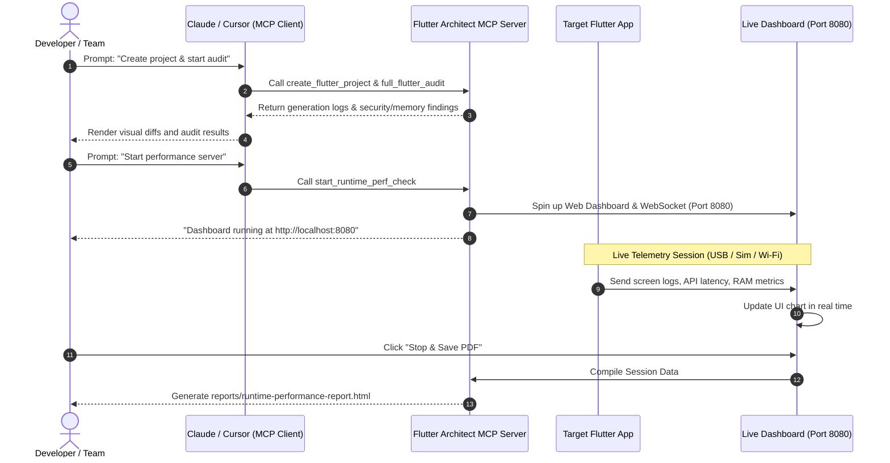

# 🚀 Flutter Architect MCP: Team Demo Guide

Welcome! This guide is designed to help you run a high-impact demo of the **Flutter Architect MCP** for your teammates. It covers the architecture, the complete tool suite, step-by-step walkthroughs, and sample AI prompts to showcase the MCP's full capabilities.

---

## 📌 Architecture Overview

Below is the interaction flow between the Developer, the LLM/Editor (Client), the MCP Server, and the target Flutter app:



---

## 🛠️ MCP Tool Reference Sheet

The MCP exposes **19 specialized tools** categorized into 5 main functional domains:

| Category | Tool Name | Description | Key Inputs |
| :--- | :--- | :--- | :--- |
| **Bootstrapping** | `create_project` <br> `create_flutter_project` | Scaffold a pre-configured Flutter project with best-practice templates, dependencies, and shared utilities. | `projectName`, `architecture`, `stateManagement`, `database`, `router`, `backend`, `runAudit` |
| **Project Analysis** | `analyze_flutter_project` <br> `detect_flutter_architecture` <br> `architecture_scan` | Inspect project metadata, detect existing architecture patterns (Clean, MVVM, MVC, etc.), and score modularity. | `projectPath`, `scanLevel` |
| **Static Analyzers** | `security_scan` <br> `secret_scan` <br> `dependency_scan` <br> `memory_scan` <br> `performance_scan` <br> `code_quality_scan` | Statically scan for secrets, insecure platform configs, unclosed streams/timers, rendering bottlenecks, and code smells. | `projectPath` |
| **Reports & Fixes** | `full_flutter_audit` <br> `generate_security_report` <br> `suggest_fixes` <br> `apply_safe_fixes` | Run all audits, output HTML/JSON/Markdown reports, generate safe edits in Git-diff format, and safely apply fixes. | `projectPath`, `generateReport` |
| **Runtime Telemetry** | `start_runtime_perf_check` <br> `runtime_memory_scan` | Spin up the local WebSocket server to receive live telemetry from the running mobile app. | `port` |

---

## 💻 Setup & Configuration for Claude Desktop

Before starting the demo, configure Claude Desktop to communicate with the MCP server:

1. Open your Claude Desktop Configuration file (macOS path: `~/Library/Application Support/Claude/claude_desktop_config.json`).
2. Add the server entry:

```json
{
  "mcpServers": {
    "flutter-architect": {
      "command": "dart",
      "args": [
        "run",
        "/Users/indianic/Desktop/Indianic_project/my_mcp/flutter_structure_mcp/bin/server.dart"
      ]
    }
  }
}
```
3. Restart Claude Desktop. You will see a new **Hammer Icon** 🔨 representing the tools.

---

## 📬 Setup & Configuration for Email Service (Mailman & SMTP)

The MCP server supports sending automated audit reports directly to team members via email. It prioritizes the **Mailman** CLI tool (recommended) with an automatic fallback to local **SMTP** or offline simulation mode.

### 1. Setting up Mailman (Recommended)
Mailman is a local CLI/MCP tool that securely manages Gmail accounts, drafts, and email dispatches.

1. **Install Mailman CLI globally** using npm:
   ```bash
   npm install -g @integratex/mailman
   ```
2. **Authorize your Gmail account** (this starts the browser OAuth2 consent flow):
   ```bash
   mailman auth login
   ```
   *Alternative command to specify credentials manually:*
   ```bash
   mailman account add
   ```
3. **Verify Configuration**:
   Check if your account is successfully registered and connected:
   ```bash
   mailman status
   ```

### 2. Setting up SMTP (Alternative Fallback)
If you prefer using standard SMTP instead of the Mailman tool:
1. Locate or create `config/email_settings.yaml` under your project root.
2. Define your SMTP server credentials:
   ```yaml
   smtp:
     host: "smtp.gmail.com"
     port: 465
     username: "your-email@gmail.com"
     password: "your-app-specific-password"
     secure: true
     from_address: "your-email@gmail.com"
     from_name: "Flutter Architect MCP"
   ```

### 3. Simulation Mode (Offline/Testing Default)
npm install -g @integratex/mailman
mailman init
If neither Mailman nor SMTP credentials are set up, the email service operates in **Simulation Mode** automatically. In this mode, generated reports and simulated email layouts are saved locally under:
* `reports/simulated_emails/email_<timestamp>.html`
* `reports/simulated_emails/attachment_<timestamp>.pdf`

---

## 🏁 Demo Flow Walkthrough

### 📦 Part 1: Scaffolding a Production-Ready App
**Goal**: Show how the MCP generates a comprehensive project setup in seconds, bypassing manually writing boilerplate.

1. **Ask the AI Client**:
   > "Create a new Flutter project named `sales_tracker` using `clean` architecture, `riverpod` for state, `drift` database, and `go_router` in a temporary directory on my Desktop."
2. **What to point out to your team**:
   * **Clean Architecture Layers**: The MCP creates clean boundaries: `domain`, `data`, `presentation` directories inside `lib/`.
   * **Dependency Injection**: It parses `config/packages.yaml` and dynamically injects correct versions into `pubspec.yaml`.
   * **Shared Assets**: Point out the automatic copy of common utility files (Connectivity helpers, extensions, validation utilities) and the import rewriting to use the new project's package name automatically.

---

### 🔍 Part 2: Static Auditing & Reports
**Goal**: Show how the server inspects code for vulnerabilities, memory leaks, and performance problems.

1. **Ask the AI Client**:
   > "Please run a full static audit on the newly created project (or our existing project path) and generate the audit reports."
2. **What to point out to your team**:
   * **Multiple Engines**: Mention that `SecurityEngine`, `MemoryEngine`, `PerformanceEngine`, and `CodeQualityScanner` run concurrently.
   * **Secret Scanner**: Show how it flags private keys or plain-text API credentials.
   * **Memory Scans**: Look for leaks (e.g., unclosed `StreamController`s, un-disposed `TextEditingController`s).
   * **Generated Reports**: Locate `reports/` in the project root. Show your team the generated JSON, Markdown, and rich HTML report files.

---

### 🩹 Part 3: Automated Dry-Run & Safe Code Fixing
**Goal**: Show the AI resolving code-quality issues with compiler safety checks.

1. **Ask the AI Client**:
   > "Suggest safe fixes for the findings you just discovered. Then, apply them safely."
2. **What to point out to your team**:
   * **Suggested Fixes**: The client shows safe modifications in standard Git diff formats.
   * **Apply & Validate**: Emphasize that when `apply_safe_fixes` is run:
     1. It applies the code changes.
     2. It runs `flutter pub get` and builds the code to ensure nothing is broken.
     3. **Automatic Rollback**: If a build fails or tests crash, it automatically rolls back changes to preserve stability.

---

### 📊 Part 4: Real-time Runtime Performance Dashboard
**Goal**: Show how a live Flutter app streams telemetry to a browser dashboard to detect bottlenecks.

1. **Ask the AI Client**:
   > "Start the runtime performance dashboard server on port 8080."
2. **Open the browser**:
   Navigate to `http://localhost:8080`. Point out the **Live Telemetry Charts**, **API Log List**, and **Navigator Observer Feed**.
3. **Show Integration Code**:
   Click on the **Integration Guide** tab in the dashboard. Point out how easy it is to drop the following three utilities into any Flutter app:
   * **Dio Interceptor**: Tracks HTTP requests, response code, and latency.
   * **Navigation Observer**: Listens to active screen changes.
   * **Memory Streamer**: Periodically sends RSS (Resident Set Size) RAM size and app database size.
4. **Show Simulator/Device Connection Paths**:
   Show your team how mobile environments resolve connection paths back to the server:
   * **iOS Simulator**: `http://localhost:8080/api/record`
   * **Android Emulator**: `http://10.0.2.2:8080/api/record`
   * **USB Android Device**: Run `adb reverse tcp:8080 tcp:8080` to route local port.
   * **Wi-Fi Device**: Same network computer IP (e.g., `http://192.168.1.100:8080/api/record`).

5. **Trigger Report Generation**:
   Let the simulator navigate or perform network calls. Point out the live telemetry changing in the browser. Finally, click **Stop & Save PDF** in the UI (or hit `/api/stop` POST). Show them the output saved to `reports/runtime-performance-report.html`.

---

## ⚡ CLI Alternative Commands (No-LLM Mode)

For team members who prefer scripting or CI/CD pipelines, demonstrate that the tools can run directly in the terminal:

* **Scaffold a Project via CLI**:
  ```bash
  dart run lib/tools/architectures_create/create_project.dart \
    --name demo_app \
    --arch mvvm \
    --state bloc \
    --db hive \
    --router go_router \
    --target ~/Desktop
  ```

* **Run Audit Scanner via CLI**:
  ```bash
  dart run lib/tools/scanners_and_audit_reports/run_audit.dart /path/to/target/project
  ```

* **Launch Runtime Server via CLI**:
  ```bash
  dart run lib/tools/scanners_and_audit_reports/run_runtime_perf.dart --port 8080
  ```

---

## 🗣️ Claude / Cursor Natural Language Prompt Reference

Here is a list of ready-to-use natural language prompts (commands) you can paste directly into Claude or Cursor to invoke the MCP server:

### 🔍 Codebase Auditing & Reports
* **Analyze a Flutter Project**:
  > "Please run a full audit on the Flutter project located at `/absolute/path/to/project`. Generate the HTML and PDF reports. (Optional: Send the report via email to `email@example.com`.)"
* **Analyze a Node.js Project**:
  > "Please run a full audit on the Node project at `/absolute/path/to/project`. Identify security flaws like eval, command injection, and sync FS operations."
* **Analyze a Vue.js Project**:
  > "Please run a full audit on the Vue project at `/absolute/path/to/project`. Inspect SFCs for v-html, unscoped styles, and missing v-for keys."
* **Analyze a Laravel PHP Project**:
  > "Please run a full audit on the Laravel project at `/absolute/path/to/project`. Check for empty encryption keys, active debug modes, and raw SQL injection risks."
* **Analyze a Python Project**:
  > "Please run a full audit on the Python project at `/absolute/path/to/project`. Check dependencies for vulnerabilities, and inspect code for eval or subprocess command injections."
* **Multi-Technology Auto-Detection**:
  > "Run a full codebase audit on the project at `/absolute/path/to/project`. Automatically detect its technology and generate separate report files."

### 📦 Project Scaffolding
* **Scaffold a Flutter App**:
  > "Scaffold a new Flutter app named `my_app` at `/absolute/path/to/output` with MVVM architecture, Riverpod state, Drift database, and GoRouter."

### 🩹 Automated Safe Fixing (Flutter)
* **Suggest and Apply Fixes**:
  > "Generate suggested fixes for the architectural or security findings in `/absolute/path/to/project` and apply them safely, running validation build checks."

### 📊 Runtime Performance Monitor
* **Start Performance Server**:
  > "Start the performance monitor dashboard server on port `8080`."

---

## 💡 Quick Tips for a Flawless Demo
1. **Prepare a Dummy Key**: Place a dummy API key (`String apiKey = "AIzaSy..."`) in a dart file before scanning to show the secret scanner in action.
2. **Create a Memory Leak**: Leave a `StreamController` unclosed in a widget state class. Watch the `memory_scan` pick it up immediately.
3. **Keep Dashboard Open**: Have the `http://localhost:8080` tab ready in a side window before starting the telemetry server demo.
